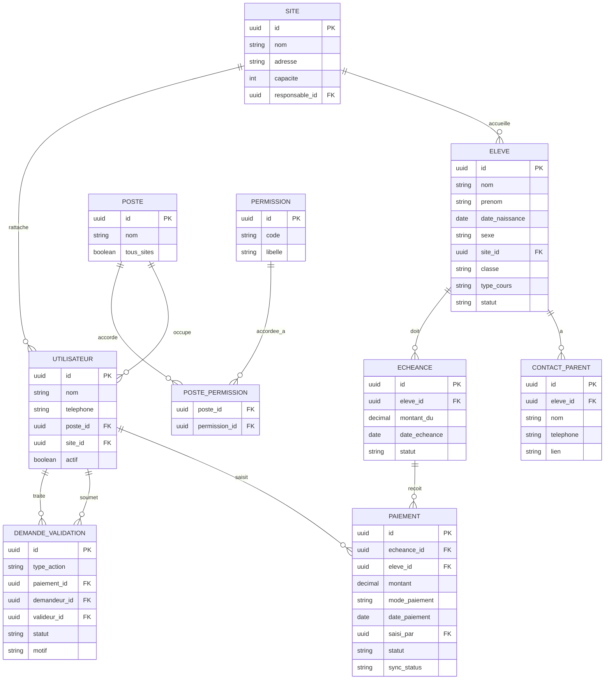

# Schéma de base de données : MVP

Ce document décrit le schéma relationnel du MVP (modules Élèves & Inscriptions, Paiements & Finances, Administration & Rôles). Les modules v2 (Enseignants, Sites détaillés, Communication, Résultats aux examens) ajouteront leurs propres tables en réutilisant ce socle.

À concevoir et valider **ensemble** avant le développement du Lot 1, puisque `ELEVE`, `SITE` et `UTILISATEUR` sont partagés entre les deux modules du MVP.

## Diagramme

## Détail des tables

### `SITE`
Un site physique de la structure.
- `responsable_id` → `UTILISATEUR` : le responsable de ce site.

### `POSTE`
Un poste occupable (Direction générale, Direction pédagogique, Responsable de site, Secrétaire, Enseignant, etc.). Les permissions ne sont **pas** codées en dur ici, elles sont assignées via `POSTE_PERMISSION`.
- `tous_sites` : `true` pour les postes de direction (accès multi-sites), `false` sinon.

### `PERMISSION`
Catalogue des permissions modulaires disponibles : `voir_finances`, `voir_pedagogie`, `gerer_comptes`, `valider_actions_sensibles`, etc. Ce catalogue est extensible sans modification du modèle de données.

### `POSTE_PERMISSION`
Table de liaison many-to-many entre postes et permissions : c'est le cœur du système de permissions modulaires.

### `UTILISATEUR`
Toute personne ayant un compte dans le système (direction, responsable de site, secrétaire, enseignant).
- `poste_id` → `POSTE` : détermine ses permissions.
- `site_id` → `SITE` : nullable si le poste a `tous_sites = true`.

### `ELEVE`
Fiche élève.
- `site_id` → `SITE`.
- `statut` : actif / inactif (ex. élève ayant quitté en cours d'année).

### `CONTACT_PARENT`
Un ou plusieurs contacts parent/tuteur par élève.
- `lien` : mère, père, tuteur, etc.

### `ECHEANCE`
Ce qui est dû par un élève à une date donnée (ex. échéance trimestrielle).
- `statut` : à jour / partiel / en retard : recalculé automatiquement à partir des paiements liés.

### `PAIEMENT`
Un paiement reçu, lié à une échéance.
- `saisi_par` → `UTILISATEUR` : qui a enregistré le paiement (traçabilité).
- `statut` : validé / annulé.
- `sync_status` : synchronisé / en attente : pour le mode hors ligne de l'app mobile.
- Une échéance peut recevoir plusieurs paiements (paiements partiels).

### `DEMANDE_VALIDATION`
Table générique pour le workflow d'approbation des actions sensibles (ex. annulation d'un paiement). Réutilisable pour d'autres actions sensibles futures sans changement de structure.
- `demandeur_id` / `valideur_id` → `UTILISATEUR` : qui a demandé, qui a traité.
- `statut` : en attente / validée / rejetée.

## Points d'attention pour l'implémentation

- **Cloisonnement par site** : toute requête émise par un utilisateur dont le poste n'a pas `tous_sites = true` doit être filtrée par son `site_id` côté serveur : jamais laissé au seul contrôle de l'interface.
- **Recalcul du statut d'échéance** : à faire via un trigger DB ou une logique applicative déclenchée à chaque nouveau paiement, pas en calcul à la volée à chaque lecture (performance).
- **Synchronisation offline** : `PAIEMENT.sync_status` doit permettre d'identifier et de rejouer les paiements créés hors ligne ; prévoir une stratégie de résolution de conflits si deux paiements sont créés sur la même échéance depuis deux appareils avant synchronisation.
